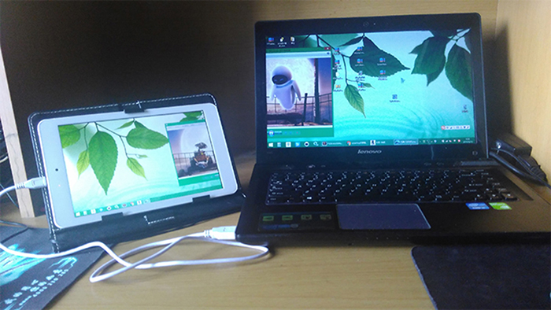

昨天，在网上做题的时候，因为用的本地编译器，所以需要不断在软件和网页之间进行切换，感觉特别不方便，再加上身边的小伙伴都用液晶显示器扩展PC的显示器，恰巧又看到了放在身边的平板，突发奇想：何不用平板作为PC的扩展屏？上网一搜，咦，还真有这样的工具软件！

我共找到了3款这样的工具软件，套路都是一样的：在PC和平板上各安装一款软件，通过无线网或者USB线进行连接、扩展屏幕。现在回过头来看，很简单的一个工作，昨天却一直从下午17点折腾到晚上23点左右，才得以大功告成！现将3款软件分别做简单介绍：

### iDisplay

搜索结果中，iDisplay出现的最多，然后就下载并安装了。可能是因为Android系统版本的问题，同样的软件，我用手机（Android 4）可以实现屏幕扩展，用平板（Android 5）却始终实现不了，试了好几个版本，然而并没有什么卵用，最终放弃了。**不过，iDisplay支持无线网和USB线两种连接方式，如果你是Android 4的话，可以一试。**

##### iDisplay使用方法如下：

1. 在官网下载安装电脑端
2. 安装后启动，第一次启动时会进行一些测试，屏幕会暗几下，别紧张。
3. 手机安装手机端，打开
4. 选择连接方式（USB 或者 WIFI）
5. 然后搜索一会就自动连接上了

##### 附：[iDisplay安装包](https://github.com/RamblerW/download/raw/master/iDisplay.zip)

### DisplayLink

在搜索iDisplay的过程中，发现了另一款屏幕扩展软件：DisplayLink。然而，它还不如iDisplay：电脑端一直显示未查找到可连接的设备。

### Splashtop XDisplay

这是3款软件里我唯一成功的一款。不过，它只支持USB连接。它的使用方法也非常简单，在PC和平板上分别安装软件后，用USB线连接平板和PC（注意：平板一定要处于USB调试模式！），把两端的软件都打开即可自动连接。

如果没有成功扩展，记得检查电脑端是否已安装Android USB驱动！（本人使用Lenovo联想驱动管理进行驱动扫描和安装）

注意：Splashtop XDisplay和Splashtop是两款软件！

##### 附：[Splashtop XDisplay安装包](https://github.com/RamblerW/download/raw/master/SplashtopXDisplay.zip)